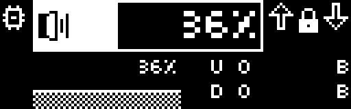
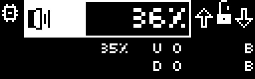

# StainedSteel Rust (KISS Edition)

Simple, purpose-built Rust driver for SteelSeries Apex 5 OLED on Linux inspired by Steelclock's Go drivers. It's stained steel because it's written in Rust.

This driver has been vibecoded for my own computer from SteelClock's sources because i am a menace. Install at your own risks and perils.
Works on an Apex 5 keyboard. Other keyboards untested.

## Screenshots





## Dashboard Features

- Key indicators for ScrlLock, NumLock and CruseCTRL.
- Volume slider for scroll wheel with Earthbound numeral display.
- Mute wheel button works.
- RAM monitor.
- CPU monitor.
- Network monitor.
- Animated elements and boot animation.
- Per-widget refresh rate.
- Easy install script, don't be afraid.

## Run

```bash
cargo run --release
```

Optional config path:

```bash
cargo run --release -- --config profiles/dashboard.json
```

Single frame then exit:

```bash
cargo run --release -- --one
```

Single frame with explicit config:

```bash
cargo run --release -- --config profiles/dashboard.json --one
```

## Permissions

You need write access to `/dev/hidraw*` for the keyboard display interface.

Use the existing udev rule from the Go project if needed:

- `Go/profiles/99-steelseries.rules`

## Notes

- Frame format matches the Go Linux direct driver:
  - Packet size: `642`
  - Packet bytes: `0x61 + 640 bytes frame + padding`
  - Frame bytes: `128x40 mono`, row-major, MSB-first
- Volume reads from `amixer get Master`.
